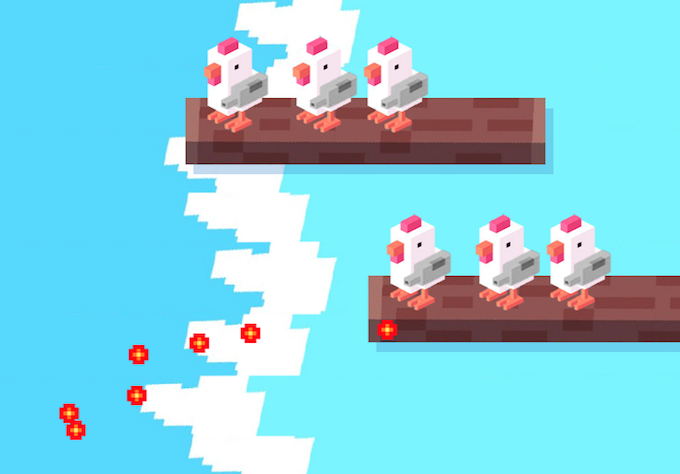

# Chicken on a raft

# install
- "use this template", kopieer naar eigen github
- clone de repo van je eigen github
- `npm install`
- `npm run dev`

  

# Opdracht

- plaats boomstammen in de game
- plaats kippen op de boomstammen
- laat de kippen meebewegen met de boomstammen
- laat de kippen heen en weer bewegen op de boomstammen
- maak de background een class 
- [Inspiratie](https://www.youtube.com/watch?v=yVihOxP2QeY)